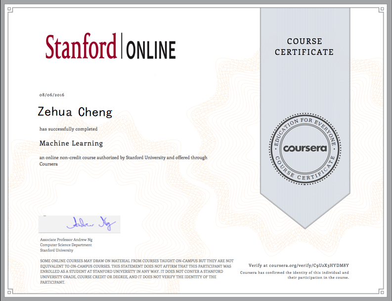

# Machine Learning taught by Andrew Ng

This project contains solutions to the Stanford Machine Learning course exercises implemented with Octave. This project respects the Coursera Honor Code as the presented solutions can't be used to derive the lower-level Octave code that must be written to complete the assignments.

What's more, I have collect some other rescource that implemented with Jupyter(python). 

**However, I did not implemented the project in Jupyter notebook.**

If you are interested in the implement by Jupyter Notebook, please [click this](https://github.com/krasserm/machine-learning-notebooks). All the credict reserved by [Martin Krasser](https://github.com/krasserm)